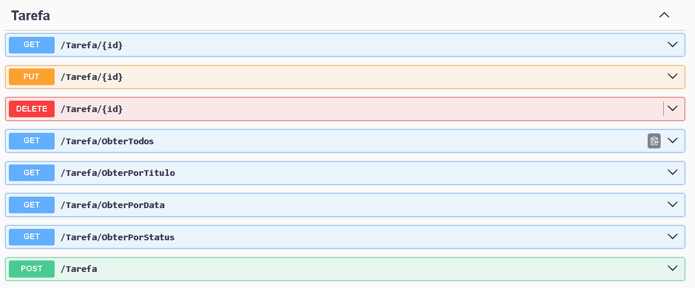

# TaskMasterApi
API de gerenciamento de tarefas desenvolvida em **C#**, **.NET 8**, **Entity Framework 9** e **SQL Server**.

---
## Projeto
CRUD completo para tarefas, com filtros por título, data e status. Documentação disponível via **Swagger**.

---

## Contexto
Construir um sistema gerenciador de tarefas, permitindo criar, atualizar, deletar e listar tarefas, organizando melhor a rotina.

---

## Classe Principal

Classe de tarefa:


---

## Métodos esperados

**Swagger**



---

**Endpoints**

| Verbo  | Endpoint                | Parâmetro | Body          |
|--------|-------------------------|-----------|---------------|
| GET    | /Tarefa/{id}            | id        | N/A           |
| PUT    | /Tarefa/{id}            | id        | Schema Tarefa |
| DELETE | /Tarefa/{id}            | id        | N/A           |
| GET    | /Tarefa/ObterTodos      | N/A       | N/A           |
| GET    | /Tarefa/ObterPorTitulo  | titulo    | N/A           |
| GET    | /Tarefa/ObterPorData    | data      | N/A           |
| GET    | /Tarefa/ObterPorStatus  | status    | N/A           |
| POST   | /Tarefa                 | N/A       | Schema Tarefa |

---
## Schema  de Tarefa
```json
{
  "id": 0,
  "titulo": "string",
  "descricao": "string",
  "data": "2022-06-08T01:31:07.056Z",
  "status": "Pendente"
}
```


---
## Estrutura do Projeto

```
TaskMasterApi/
│
├─ Api/Entities/
├─ Api/Context/
├─ Api/Controllers/
├─ Api/Migrations/
├─ Api/docs/images/
├─ Api/appsettings.json
├─ Api/Program.cs
├─ Api/TaskMasterApi.csproj
├─ Test/
└─ README.md


```

## Licença

Este projeto está licenciado sob a Licença MIT - veja o arquivo [LICENSE](LICENSE) para mais detalhes.

---
